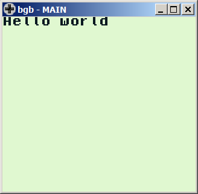
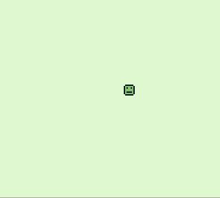
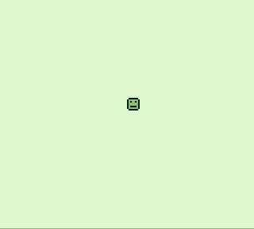
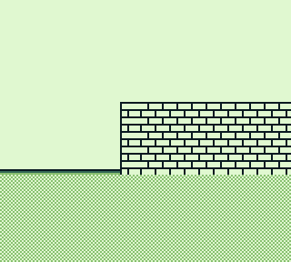
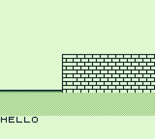
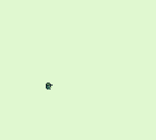
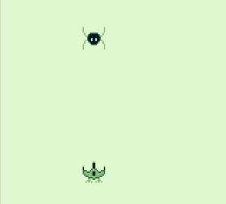
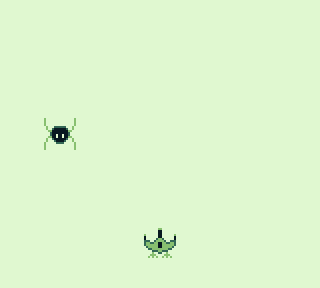
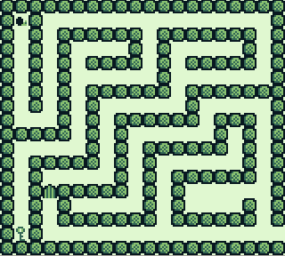
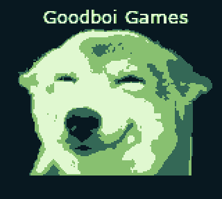

# GB_projects

This code in this repo is based on the video series **Learn how to develop your own GameBoy games** from the channel **GamingMonsters**.

## 1_helloworld

links used:
+ [GBDK](http://bit.ly/2BuCvsR) 
+ [BAT file](http://bit.ly/2QfD4Pp)
+ [BGB emulator](http://bgb.bircd.org/)

## 2_sprites 

It is added a sprite in the *game*.

There are 3 layers of graphics:
+ *screen layer*
+ *sprite layer*
+ *background layer*

links used:
+ [GBTD](http://www.devrs.com/gb/hmgd/gbtd.html)

## 3_joypad
It is added the joypad functionality were the smile moves depending on the key pressed.

## 4_background

Background with movement.

Utility used:
+ [GBMB](http://www.devrs.com/gb/hmgd/gbmb.html)

## 5_window
The last layer: the window layer. This layer is located in top of the others, son in order to see the background it is moved to the floor.

## 6_sounds
The GB has 4 channels:
+ Channels 1 and 2: quadrangular wave
+ Channel 3: programmable wave table
+ Channel 4: noise generator

In this section, It is used the channel 1 to create a jumping noise.

## 7_noise
A noise sound is created using channel 4.

Usefull link to test sounds:
https://github.com/Zal0/GBSoundDemo

## 8_jumping

A jump function is implemented as well as horizontal movement. 

A little of *physics" is implemented in order to recreate a jumping movement.

## 9_meta-sprite
Two sprites are displayed in the screen at the same time.

## 10_sprite_collision_detection

It was implemented a collision function between sprites. 

## 11_background_collision_detection
A mini game was implemented using background collision detection.

## 12_Splashscreens
In this tutorial It was taught how to add a start image or splashscreen.

## 13_fade_effect
Guess what... a fade effect was added to the splashscreen.

This is made by modifying the *BGP_REG* register.

## Video serie link:
+ [Learn how to develop your own GameBoy games](https://www.youtube.com/playlist?list=PLeEj4c2zF7PaFv5MPYhNAkBGrkx4iPGJos)
+ [Repo](http://bit.ly/2t676I4)